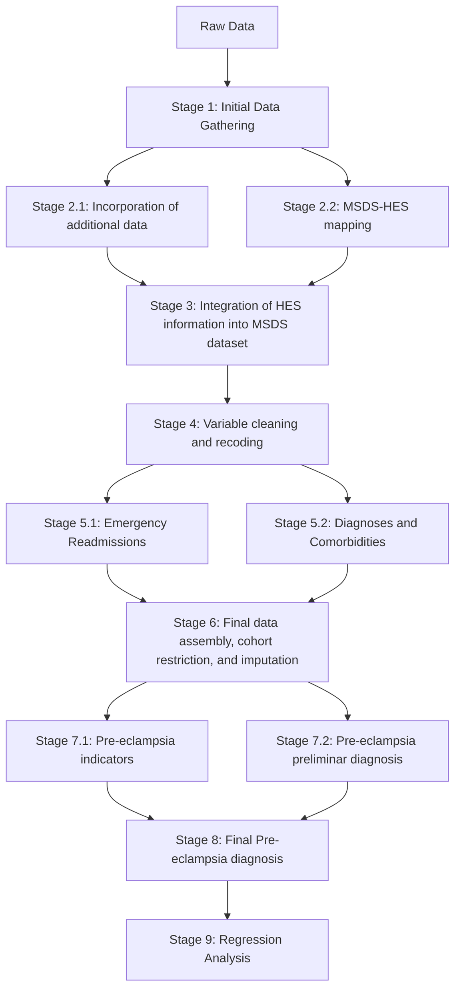

# 1. Overview
This study aims to examine the association between area-level deprivation and maternal pre-eclampsia outcomes in England.
The resulting regression analysis will inform the conclusions of the study.

The analysis uses data sourced from the Maternity Service Data Set (MSDS), the Emergency Care Data Set (ECDS), and the Hospital Episode Statistics data set (HES), all managed by NHS England. These are electronic health records of patient-level information related to pregnancies and births in the NHS:

- The MSDS collects patient-level data at key stages of the maternity service care pathway, from the first antenatal booking appointment, diagnosis throughout pregnancy, outcome of deliveries for mothers and babies, until mother and babies are discharged from maternity services.
- The ECDS contains structured, patient-level information on attendances at emergency departments, including patient demographics, presenting complaints, clinical diagnoses, investigations, treatments, and outcomes.
- The HES covers admissions, outpatient appointments and historical accident and emergency attendances at NHS hospitals in England.

The study then applies a regression framework to evaluate the relationship between:

- Outcome: pre-eclampsia, early onset pre-eclampsia (< 34 weeks), late onset pre-eclampsia (≥ 34 weeks)
- Exposure(s): area-level socioeconomic deprivation
- Covariates: confounders (age, ethnicity, language) and mediators (BMI, social factors, medical history)

The preprocessing pipeline is implemented as a series of Databricks notebooks that transform raw data into an analysis-ready dataset.

---

# 2. Pipeline Summary

---

# 3. Data Description

## Data Sources
- MSDS: all unique pregnancies, as identified by a unique pregnancy ID (UniqPregID)
- ECDS: all entries corresponding to the history of a mother in the MSDS, matched to MSDS records through a unique pseudo-NHS identifier (Person_ID_DEID)
- HES: all entries corresponding to hospital episodes involving a mother in the MSDS, matched to MSDS records through a unique pseudo-NHS identifier (Person_ID_DEID)

## Key Variables
- Outcome: 
  - pre-eclampsia,
  - early onset pre-eclampsia (< 34 weeks), 
  - late onset pre-eclampsia (≥ 34 weeks)
- Exposure(s): area-level socioeconomic deprivation, identified through the mother's Index of Multiple Deprivation (IMD); a pregnancy where the mother's IMD is ≤ 3 is considered _deprived_
- Covariates:
  - Confounders:
    - Maternal age
    - Ethnicity (White, Black, South Asian, Mixed, Other)
    - Language (English vs Not English)
  - Mediators:
    - Maternal BMI
    - Smoking status (ever smoked vs never)
    - Folic acid intake throughout the pregnancy
    - Percentage of contacts attended (over total scheduled contacts)
    - Medical history: prior preeclampsia, prior gestational diabetes mellitus, endocrine/metabolic diseases, mental disorders, nervous system diseases, circulatory diseases, respiratory diseases, gastrointestinal diseases, musculoskeletal diseases, malformations/abnormalities

## Inclusion / Exclusion Criteria
- Maternal age < 13 or > 60
- Multiparous pregnancies (more than 1 baby)
- Births before 2021
- Pregnancies with missing IMD
- Pregnancies with inconsisten birth year and year of admission to labour and delivery services (max 1 year apart)
- Pregnancies of women with a previous recorded birth in the system (i.e. subsequent pregnancies are removed, keeping only the first)

## Notes
- Complete anonimity is garanteed to each person involved in this study:
  - Pregnancies are identified through a unique pregnancy ID, which is linked to the mother through an anonymous NHS pseudo-identifier. 
  - The data used in the study are only accessible in the SDE platform, to which access is agranted through an agreement with the NHS.

---

# 4. Environment & Requirements

## Platform
- Databricks Runtime: Serverless / 17.3 LTS

## Languages
- Python: 3.12.3 / PySpark: 4.0.0

## Key Libraries
- sys
- numpy, pandas, matplotlib
- pyspark.sql.functions, pyspark.sql.SparkSession, pyspark.sql.types
- pyspark.ml.regression, pyspark.ml.feature, pyspark.ml.functions

## Additional Requirements
- Two clusters are available for use on the SDE platform:
  - Serverless cluster [no fee]
  - Unity Catalog cluster 
- These are not available for use outside of the platform

---

# 5. Notebook Walkthrough

## Notebook 1: Stage01_initial_data_gathering

**Purpose:**  
In this notebook the master data set is initialised with baseline information. This is the table that will eventually contain all the polished and derived information necessary for the the regression analysis.

**Inputs:**  
- None

**Key Steps:**  
- Load the MSDS demographics table: `msds_v2_demographics_booking_and_pregnancy_all_years`
- Correct the IMD `string` coding, converting to `int`
- Convert the dtypes of variables that are supposed to be numeric with `try_cast(int)`
  - e.g. `ageatbookingmother`, `carecontact_attended_count`, `previouslivebirths`, ...
- Initialise list of features to keep, starting with `UniqPregID`
- Aggregate the data frame across unique pregnancies with the appropriate aggregation rule for each variable (`first` for `ageatbookingmother`, `collect_set` for `folicacidsupplement`, etc.)
- Select only the features to keep
- Save data frame for the next stage

**Outputs:**  
- Provisional master df (DataFrame): `msds_demographics_agg_by_uniqpregid` 

---

## Notebook 2.1: Stage02_1_join_across_MSDS

**Purpose:**  
Add key information to the master data set from other MSDS tables.

**Inputs:**  
- Master df from Stage01: `msds_demographics_agg_by_uniqpregid` 

**Key Steps:**  
- Load the master data set
- Load the MSDS baby activities table (`msds_v2_baby_activities_all_years`) and aggregate across `UniqPregID`
  - From this table, we gather the number of critical incidents, the Apgar score at birth, and the birth weight
- Load the MSDS baby demographics table (`msds_v2_baby_demographics_all_years`) and aggregate across `UniqPregID`
  - From this table, we gather data such as the delivery method, day of week, month and year of birth of the baby, the pregnancy outcome, and the site of delivery
- Load the MSDS care activities table (`msds_v2_care_activities_all_years`), aggregate across `UniqPregID` and derive some intermediary variables
  - From this table, we gather the alcohol consumption per week, the number of cigarettes smoked per day, the height and weight of the mother, and the smoking status
- Load the MSDS labour activities table (`msds_v2_labour_activities_all_years`) and aggregate across `UniqPregID`
  - From this table, we gather the set of maternal critical incidents during labour
- Join these four new dfs to the master data set on the `UniqPregID`, retaining all the entries from the master df
- At each step the list of selected features to keep is expanded, and now only those in the list are retained in the master df
- Save updated master data frame for the next stage

**Outputs:**  
- Provisional master df (DataFrame): `msds_all_agg_filtered` 

---

## Notebook 2.2: Stage02_2_map_join_MSDS_HES

**Purpose:**  
Map each pregnancy in the MSDS data set to a hospital episode in the HES data set, and collect all the episodes corresponding to a pregnancy-related event.

**Inputs:**  
- Master df from Stage01: `msds_demographics_agg_by_uniqpregid` 

**Key Steps:**  
- Load the master data set
- Load the HES APC table (`hes_apc_all_years`), filtering for only those entries representing pregnancy-related episodes (`EPIKEY in [2, 3, 5, 6]`)
  - The loaded table is named `df_hes_apc`
- Ensure the variables from the HES APC df meant to be dates and integers are of the correct dtype
- Agregate the HES APC df across the anonymous unique pseudo-identifier (`PERSON_ID_DEID`) and the admission date to the hospital (`ADMIDATE`)
- Match each HES APC entry to a labour and delivery event corresponding to a MSDS pregnancy by matching to the person identifier of the mother (present in both the master df and the HES APC table) and isolating episodes where the admission date is within the LD (labour and delivery) start date reported in the master df
  - The result of a join between the master df and the HES APC table is named `map_msds_hes`
- Once the LD episode from HES APC has been matched to the pregnancy, a new df with only the respective identifies is created:
  - `UniqPregID` for the MSDS side: unique pregnancy identifier
  - `EPIKEY` for the HES APC side: unique episode identifier
  This new df is named `df_msds_hes`
- Save the aggregated HES APC pregnancy records (`df_hes_apc`) and the MSDS-HES mapping (`df_msds_hes`) for later stages

**Outputs:**  
- HES APC pregnancy records: `hes_aggregated_LD_spells` (`df_hes_apc`)
- MSDS-HES mapping: `msds_hes_mapping` (`df_msds_hes`)

**Notes:**
- The HES MAT table is also loaded (`hes_mat_all_year`) but eventually not used

---

## Notebook 3: Stage03_fill_MSDS_vars_from_HES

**Purpose:**  
Fill missingn MSDS information for jey variables with data from the equivalent variables in the HES data set.

**Inputs:**  
- Master df from Stage 2.1: `msds_all_agg_filtered` 
- MSDS-HES mapping from Stage 2.2: `msds_hes_mapping`
- HES APC delivery episodes from Stage 2.2: `hes_aggregated_LD_spells`

**Key Steps:**  
- Load the dfs from Stages 2.1 and 2.2
- Join the master df with the MSDS-HES map
- Amend the improbable values in the master df and then fill where possible from the HES df for the following variables: 
  - birth weight (`BIRWEIT`), 
  - birth outcome (`BIRSTAT`),
  - gestation length at booking (`ANAGEST`), 
  - gestation length at birth (`GESTAT`),
  - delivery method (`DELMETH`),
  - hospital admission date for LD (`ADMIDATE`),
  - hospital discharge date from LD (`DISDATE`), 
  - LD site identifier (`SITETRET`),
  - number of births (`NUMBABY`).
- Extract –when possible– the birth date as `birth_date = antenatal_appt_date - gest_at_booking + gestation_length_at_birth`, and derive from it the birth month and birth year (keep the old values otherwise)
  - After this step, birth year is filled from HES where still `Null` (`BIRYEAR`)
- Save updated master data frame for the next stage

**Outputs:**  
- Provisional master df: `msds_joined_filtered_filled`

---

## Notebook 4: Stage04_clean_recode_MSDS_vars

**Purpose:**  
Recode and categorise key variables and occasionally filter.

**Inputs:**  
- Master df from Stage03: `msds_joined_filtered_filled`

**Key Steps:**  
- Load the master data set
- Initialise new list of features to keep
- The following variables are recoded or categorised:
  - Critical care indicator: [`Y`/`N`] -> [`1`/`0`]
  - Birth weight: `int` -> binary categories (very low, low, normal, high)
  - Apgar score: `int` -> binary categories (severe distress, moderate distress, low, normal)
  - Birth outcome: categorical `int` -> binary categories
  - Preterm status: `int` -> binary categories
  - Delivery method: categorical `int` -> binary categories
  - Fetal presentation: categorical `int` -> binary categories
  - Maternal age: `int` -> binary categories
    - The df is filtered to include only entries where the age of the mother is `≥ 13` and `≤ 60`
  - Maternal weight: 
    - Recoded to set to `Null` improbable values
    - Used to calculte an estimated BMI, taking as height the average height of UK women: `estimated_bmi = mother_avg_weight / (mother_avg_height**2)`
  - Maternal BMI: `int` -> binary categories
  - Maternal height: 
    - Recoded to set to `Null` improbable values
  - Drinking and smoking status: number of cigarettes per day and alcohol units per week at different times used to determine the variables `ever_smoking` and `ever_drinking`
    - Variables `stopped_smoking`, `stopped_drinking`, and `ever_substance_use` are derived from the previous
  - Various social indicators: [`Y`/`N`] -> [`1`/`0`]
  - Folic acid: [`int`] -> binary categories
  - Ethnicity: categorical `string` -> binary categories
  - Baby's ethnicity: `string` -> binary categories
  - Maternal employment: categorical `int` -> binary categories
  - Partner employment: categorical `int` -> binary categories
  - Language: categorical `string` -> binary categories
  - Religion: categorical `int` -> binary categories
  - Deprivation: binary variable defined as ` deprived IF IMD ≤ 3`
  - Sexual orientation: categorical `int` -> binary categories
  - Baby's sex: categorical `int` -> binary categories
  - Obstetric history: binary indicators derived from existing variables
  - Contact counts:
    - Implausible values are discarded
    - A new binary variable is defined to indicate a high number of contacts
  - Time of birth (meridian, day of week, month, year): categorical `string` -> binary categories
  - Days to the first antenatal appointment since the last period date and whether the mother is late to the appointment (more than 90 days) are derived from the antenatal appointment date and the last period date
    - When `Null`, the last period date is filled in the with antenatal appointment date minus 16 weeks (if the latter is available)
- Only the features to keep are selected from the df
- Save updated master data frame for the next stage

**Outputs:**  
- Provisional master df: `msds_processed_clean_vars`

---

## Notebook 5.1: Stage05_1_emergency_readmission

**Purpose:**  
Compute a binary emergency readmission variable, which indicates whether the mother was readmitted to the hospital within 6 weeks postpartum, likely due to complications or emergency issues related to the pregnancy and delivery.

**Inputs:**  
- Master df from Stage04: `msds_processed_clean_vars`

**Key Steps:**  
- Load the master data set
- Select key information from master df: unique pregnancy identifier (`UniqPregID`), person identifier (`person_id_deid`), date of discharge from labour and delivery services (`ld_disch_date`)
- Load data sources for readmissions: HES APC, HES AE, ECDS
- Join to selected master df to include only mothers from the master data set, and limit to 42 days post-partum
- Filter diagnoses by keywords describing pregnancy-related issues and complications
- Identify pregnancy IDs of women who had an emergency readmission
- Add `emergency_readmission` variable to master data set
- Save updated master data frame for the next stage

**Outputs:**  
- Provisional master df with readmission data: `msds_with_readmission`

---

## Notebook 5.2: Stage05_2_diagnoses_and_comorbidities

**Purpose:**  
Create indicators for key diagnoses and comorbidities.

**Inputs:**  
- Master df from Stage04: `msds_processed_clean_vars`

**Key Steps:**  
- Obtain reliable values for the following variables related to the LD (labour and delivery) process:
  - Hospital site ID (`ld_hosp_org_site_id`): place of birth of the baby, if born in a NHS hospital
  - LD start date (`ld_hosp_start_date`): admission date of the mother to the hospital upon start of labour
  - LD discharge date (`ld_hosp_disch_date`): date of discharge of the mother from the hospital following LD
- Hold the three variables to the following condition to ensure a valid representation of the mother giving birth: `(ld_hosp_org_site_id NOT Null) & (ld_hosp_start_date NOT Null) & (ld_hosp_disch_date NOT Null) & (ld_hosp_start_date ≤ ld_hosp_disch_date)`
- Load personal diagnosis based on `Person_ID_DEID` from MSDS, ECDS, HES APC, and HES AE records
- Create binary indicators for a select group of conditions
- Save the diagnosis table for the next stage

**Outputs:**  
- Df with LD information: `msds_ld_data`
- Df with diagnoses and comorbidities: `all_datasets_diagnoses`

---

## Notebook 6: Stage06_filter_reduce_master_data

**Purpose:**  
Apply exclusion criteria and run imputation to get the next and almost final version of the master data set.

**Inputs:**  
- Master df from Stage05_1: `msds_with_readmission`
- LD information df from Stage05_2: `msds_ld_data`
- Diagnosis and comorbidities data Stage05_2: `all_datasets_diagnoses`

**Key Steps:**  
- Join the LD information and the diagnosis data to the master data set to get a new updated master df with all the information collected so far 
- Generate a length of stay variable, calculated as the days between the start and end of the LD process
  - Use the new variable to create a binary indicator of whether the LOS is higher than normal (`LOS ≥ 4`) or not
- Detect for each pregnancy whether there is a previous pregnancy associated to the mother
- Apply filtering rules. Keep pregnancies:
  - with birth year ≥ 2021
  - with non-Null IMD
  - where birth year and LD discharge date year are coherent (1 year apart at most)
  - where the hospital site is non-Null (but it is actually filled with placeholder values 'ZZZZ' rather than removed)
- Drop some intermediary diagnosis column
- Save pre-imputed data as `msds_diag_busy_filtered_final`
- Run k-imputation based on birth year and IMD decile
- Save imputed data as `msds_diag_busy_filtered_final_imputed`

**Outputs:**  
- Provisional master data set: `msds_diag_busy_filtered_final_imputed`

---

## Notebook 7.1: Stage07_1_preeclampsia_indicators

**Purpose:**  
Filter to include only the first pregnancy in the data set per mother, and create binary variables for pre-eclampsia indicators.

**Inputs:**  
- Master df from Stage06: `msds_diag_busy_filtered_final_imputed`

**Key Steps:**  
- Derive:
  - the estimated pregnancy start date by substracting 40 weeks to the estimated delivery date
  - the estimated LD discharge date (`est_ld_disch_date`) by adding 2 weeks to the current LD discharge date (`ld_hosp_disch_date`) when available, or by adding 2 weeks to the estimated delivery date otherwise
- Correct LD discharge date and estimated LD discharge date by cutting both off at 42 weeks after the last period date and the estimated pregnancy start respectively
- Restrict the master data set to the earliest pregnancy in the data set for each mother
- Load findings and observations information from:
  - MSDS findings and observations
  - MSDS diagnoses (filtered to include only entries where `DiagnosisType == Pregnancy`)
  - HES APC
  - ECDS
- Identify all ocurrences of hypertension, proteinuria, or high PlGF in women listed in the master df throughout the duration of their pregnancy (between the last period date and the date of discharge from LD)
- Create counting variables for each of the 3 conditions, to indicate for each pregnancy how many times the condition was recorded
  - `Hypertension_count`, `Proteinuria_count`, `PlGF_test`
- Save the provisional master df for later use as `msds_diag_busy_filtered_final_imputed_reduced`

**Outputs:**  
- Provisional master df: `msds_diag_busy_filtered_final_imputed_reduced`

---

## Notebook 7: Stage07_2_preliminar_preeclampsia_diagnosis

**Purpose:**  
Make a provisional diagnosis of pre-eclampsia, and time it as early or late onset.

**Inputs:**  
- Master df from Stage06: `msds_diag_busy_filtered_final_imputed`

**Key Steps:**  
- Recalculate he estimated pregnancy start date by substracting 40 weeks to the estimated delivery date
- Replicate diagnosis method from Stage05_2 but retain (earliest) diagnosis date
  - Sources: MSDS, HES APC, ECDS
- Calculate the pregnancy onset (`Preeclampsia_onset`), i.e. time from the estimated pregnancy start to the diagnosis date
- Define the binary variables:
  - `Preeclampsia_during_this_pregnancy`: obtained similarly to the Stage05_2 diagnosis
  - `Preeclampsia_early_onset`: 1 if `Preeclampsia_during_this_pregnancy == 1` and the diagnosis date is less than 34 weeks away from the estimated pregnancy start
  - `Preeclampsia_late_onset`: 1 if `Preeclampsia_during_this_pregnancy == 1`, `Preeclampsia_early_onset == 0`, and the diagnosis date is 34 weeks or more away from the estimated pregnancy start
- Save the pre-eclampsia diagnosis information for the next step: `msds_diag_busy_filtered_final_imputed_preeclampsia_diag`
  - Select only `UniqPregID`, `Preeclampsia_onset`, `Preeclampsia_during_this_pregnancy`, `Preeclampsia_early_onset`, `Preeclampsia_late_onset`

**Outputs:**  
- Provisional pre-eclampsia diagnosis data: `msds_diag_busy_filtered_final_imputed_preeclampsia_diag`

---

## Notebook 8: Stage08_preeclampsia_diagnosis

**Purpose:**  
Compile the definitive pre-eclampsia diagnosis, create a new variable to measure the percentage of scheduled contacts attended, recalculate the smoking variable, and stratify the population.

**Inputs:**  
- Master df with pre-eclampsia indicators from Stage07_1: `msds_diag_busy_filtered_final_imputed_reduced`
- Df with preliminary pre-eclampsia diagnosis data from Stage07_2: `msds_diag_busy_filtered_final_imputed_preeclampsia_diag`

**Key Steps:**  
- Merge the data from Stage07_1 and Stage07_2, bringing together the master df, the pre-eclampsia indicators and diagnoses
- Create the auxiliary variable `Possible_preeclampsia_diagnosis_AND1x_or_Hyp2x`: a possible pre-eclampsia diagnosis is identified if there is either
  - At least 1 count of hypertension AND at least 1 count of proteinuria, OR
  - At least 2 counts of hypertension
- Define the final pre-eclampsia diagnosis indicator: a pre-eclampsia diagnosis is confirmed if it was already preliminarily diagnosed in Stage07_2 AND the above condition holds
- Adjust early- and late-onset pre-eclampsia indicators to the newly determined final pre-eclampsia diagnosis
- Define a new `ever_smoker` variable - which indicates whether the mother has _ever_ smoked - according to the SDE example
- Define a new continuous variable indicating the percentage of scheduled contacts which were actually attended by the mother
- Stratify the population into two groups:
  - Group 1: nulliparous women (never gave birth) who have _never_ been diagnoses with pre-eclampsia nor gestational diabetes mellitus
  - Group 2: parous women (gave birth at least once)
- Set `Preeclampsia_onset` to 42 weeks + 1 day for cases were pre-eclampsia was _not_ diagnosed as placeholder necessary for external Cox Proportional Hazards analysis
  - Download excel version of master data set for use in R: `full_master_df_for_regression.xlsx` 
- Save the final master data set to be used in the regression analysis: `msds_diag_busy_filtered_final_imputed_reduced_timed_ind`

**Outputs:**  
- Final master data frame: `msds_diag_busy_filtered_final_imputed_reduced_timed_ind`

---

## Notebook 9: Stage09_preeclampsia_mixed_regression

**Purpose:**  
Run the regression analysis on the selected model.

**Inputs:**  
- Master data set: `msds_diag_busy_filtered_final_imputed_reduced_timed_ind`

**Key Steps:**  
- Select the mode for the run:
  - `model` determines the fixed effects
    - Model 1: socioeconomic deprivation
    - Model 2: socioeconomic deprivation + confounders
    - Model 3: socioeconomic deprivation + confounders + mediators
  - `mixef_effects_cols` determines the random effects
    - [a] `mixef_effects_cols = ["birth_year"]`: only birth year as the random effect to account for year to year variations
    - [b] `mixef_effects_cols = ["birth_year", "ld_hosp_org_site-id"]`: hospital site added as random effect to account for possible differences in care across NHS trusts
- Prepare the data set for regression:
  - Isolate by group
  - Select outcome, features, and random effects
  - Remove entries with `Null` outcome
- Run the regression for each of the following settings:
  - Group 1 - Pre-eclampsia
  - Group 1 - Early Onset Pre-eclampsia
  - Group 1 - Late Onset Pre-eclampsia
  - Group 2 - Pre-eclampsia
  - Group 2 - Early Onset Pre-eclampsia
  - Group 2 - Late Onset Pre-eclampsia
- Save the summary of each run in a single excel file

**Outputs:**  
- Regression results for the selected mode

---

# 6. Regression Analysis

The regression analysis is implemented in:

- Stage09_preeclampsia_mixed_regression

## Model Specification
- Model type: Generalised Linear Mixed Model with Penalised Quasi-Likelihood
- Outcome: Pre-eclampsia, Early Onset Pre-eclampsia, Late Onset Pre-eclampsia
- Predictors: Socioeconomic deprivation
- Covariates: Confounders + Mediators

## Additional Details
- The missingness and statistics tables found in the draft can be obtained by running notebook `Stage10_tables`, which collects the information from the final master data set produced at Stage 8.

---

# 7. Cox Proportional Hazards Analysis
As a robustness check, we also run a Cox Proportional Hazards model. To do this, as the necessary libraries were not available on the PySpark version on Databricks, we downloaded the master data set with selected features and run it 

## R file: CoxPH_analysis
**Purpose**
Run the Cox PH analysis on the three models, and plot the Kaplan-Meier survival curves for pre-eclampsia.

**Inputs:**  
- Master data set: `full_master_df_for_regression.xlsx`

**Key Steps:**  
- Load the data
- Define regressors, random effects, and models
- Stratify the data
- Create a 4-nested loop to run all the combinations:
  - Loop 1: random effect variants 
    - [a] for only `birth_year`
    - [b] for `birth_year` + `ld_hosp_org_site_id`
  - Loop 2: stratified population
    - Group 1: nullipara with no prior pre-eclampsia nor gestational DM
    - Group 2: multipara
  - Loop 3: model
    - M1: socioeconomic deprivation
    - M2: socioeconomic deprivation + confounders
    - M3: socioeconomic deprivation + confounders + mediators
  - Loop 4: outcome
    - Pre-eclampsia
    - Early-onset pre-eclampsia
    - Late-onset pre-eclampsia
- Cox PH model requires to define the time to the event, where the event is the pre-eclampsia dignosis. In this case, we used the variable `Preeclampsia_onset`
- Save each Hazard Ratios table, and collect all results in a single `.csv`
- Plot the Kaplan-Meier survival curves for all 3 population configurations (all, group 1, group 2)
  - This plot documents the chances of not being diagnoses with pre-eclampsia (survival) as the time passes. The threashold was estabilished at 42 weeks + 1 day
- Save all 3 plots 

---

# 8. How to Reproduce Results

Run the notebooks in the following order:

1. Stage01_initial_data_gathering
2. Stage02_1_join_across_MSDS | Stage02_2_map_join_MSDS_HES
3. Stage03_fill_MSDS_vars_from_HES
4. Stage04_clean_recode_MSDS_vars
5. Stage05_1_emergency_readmission | Stage05_2_diagnoses_and_comorbidities
6. Stage06_filter_reduce_master_data
7. Stage07_1_preeclampsia_indicators | Stage07_2_preliminar_preeclampsia_diagnosis
8. Stage08_preeclampsia_diagnosis
9. Stage09_preeclampsia_mixed_regression

## Notes
- Ensure all intermediate datasets are successfully generated before proceeding
- Estimated runtime: 25 hours

---

# 9. Project Structure
/notebooks
- Stage01_initial_data_gathering
- Stage02_1_join_across_MSDS
- Stage02_2_map_join_MSDS_HES
- Stage03_fill_MSDS_vars_from_HES
- Stage04_clean_recode_MSDS_vars
- Stage05_1_emergency_readmission
- Stage05_2_diagnoses_and_comorbidities
- Stage06_filter_reduce_master_data
- Stage07_1_preeclampsia_indicators
- Stage07_2_preliminar_preeclampsia_diagnosis
- Stage08_preeclampsia_diagnosis
- Stage09_preeclampsia_mixed_regression
- Stage10_tables

/R scripts
- CoxPH_analysis

/data
- `msds_v2[x]`, `lowlat_ecds[y]`, `hes_apc[z]` data sets 

/outputs
- Master data set: `full_master_df_for_regression.xlsx`
- Regression results: `mixed_regression_results_with_CI_m{model}_{random_effects_mode}.xlsx`
- HR tables
- Survival curves

README.md

---

# 10. Notes for Reviewers

- Key tables in the paper are generated in the regression notebook (`Stage09_preeclampsia_mixed_regression`). Other tables with variable information are either generated in an additional notebook (`Stage10`) or outside of the platform (manually implemented data dictionary table).
- Data can only be accessed through the SDE platform, so results are not readily reproducible 

---

# 11. Contact

For questions or clarifications:

- Name: Agni Orfanoudaki, Yueyang Zhong, Harshita Kajaria Montag
- Email: agni.orfanoudaki@sbs.ox.ac.uk, yzhong@london.edu, hkmontag@iu.edu
